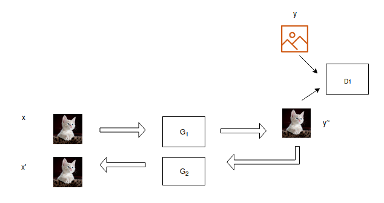

### Helper

#### Contents

- Model
- Directory structure of Dataset
- Discriminator(s)
- Generator(s)
- TODOs
- Loss functions


### Model
Only Forward Cycle variant with G1 being EDSR.




#### Directory Structure
Modify ```dataloader.py``` accordingly.
```
Dataset 
└───div2k
│   └───images
│       │   image1.png
│       │   image2.png
│       │   ... 
 
└───celebA
│   └───align
|        └───images
│           │   image1.png
│           │   image2.png
│           │       ...
```


#### Discriminator
```Discriminator come in two flavours:  With and without Spectral Normalisation ```
- With SpectralNorm, we can only use two loss functions: Wasserstein and wasserstein loss with gradient penalty. 
SpecNorm is much better way to enforce 1-Lipschitz constraint on D.[Spectral Normalisation](https://openreview.net/forum?id=B1QRgziT-)

 Note: Using conventional loss function Without Spectral Normalisation: LS Loss.

#### Imp. - We have to adjust optimizers accordingly, if we want to use different Discriminators.

#### Generators: 
- Still looking for good G-Two network. 

           Synthesized images are not adequate.
           
- G-One can do better, however in this model we are using EDSR. 

##### TODOs:
- [ ] Find best variant for G-Two. 
- [ ] Hyperparameter search for learning rates. 
- [x] FIDs.
- [ ] Try with different variants of data preprocessing.
- [x] Spectral Normalisation.

### Losses
- [ ] Hinge Loss.
- [x] Total Variation
- [x] Perceptual Distance.
- [x] MSE
- [ ] Wasserstein and Wasserstein with gradient penalty.